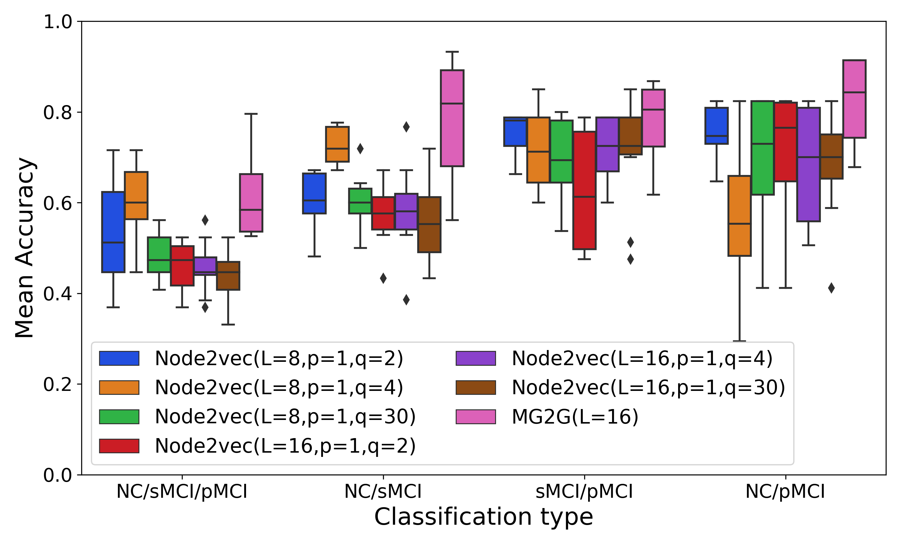
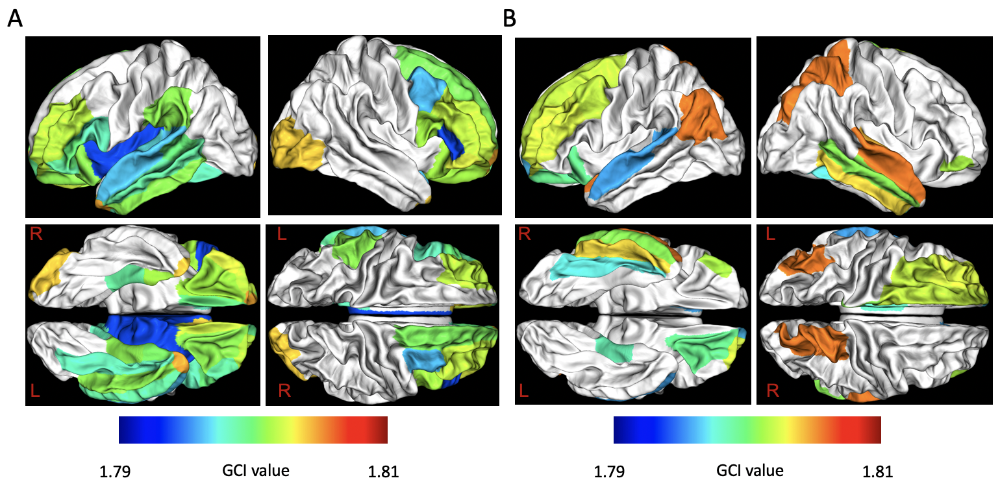
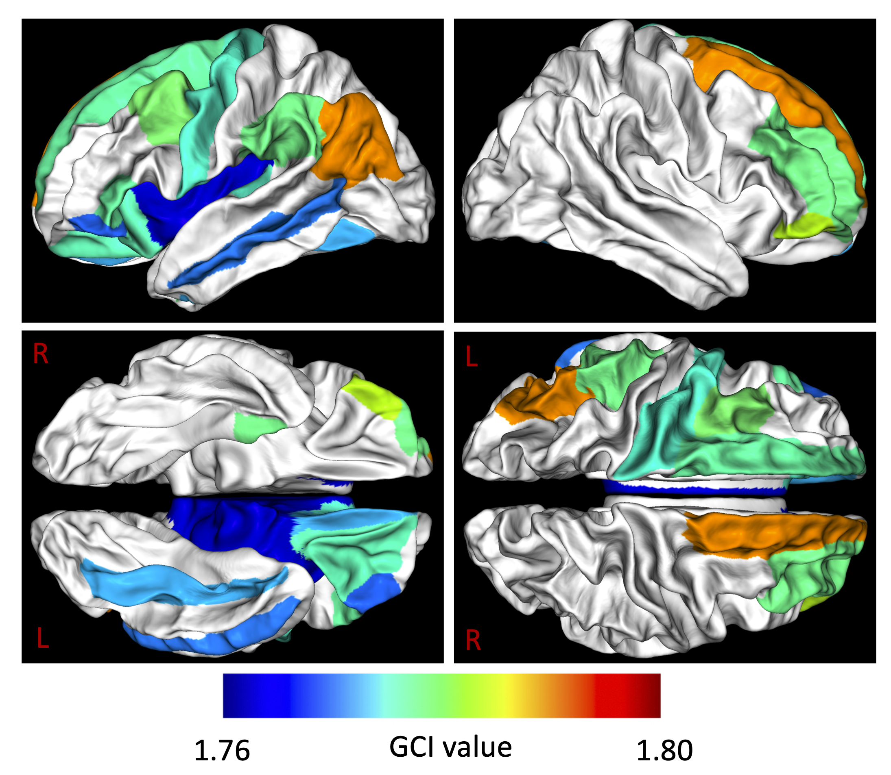

# MEG_AD_project (AD progression prediction based on MEG brain networks)
## Summary
Characterizing the subtle changes of functional
brain networks associated with the pathological cascade of
Alzheimer’s disease (AD) is important for early diagnosis and
prediction of disease progression prior to clinical symptoms. We
developed a new deep learning method, termed multiple graph
Gaussian embedding model, which can learn highly
informative network features by mapping high-dimensional
resting-state brain networks into a low-dimensional latent space.
These latent distribution-based embeddings enable a quantitative
characterization of subtle and heterogeneous brain connectivity
patterns at different regions, and can be used as input to
traditional classifiers for various downstream graph analytic
tasks, such as AD early stage prediction, and statistical evaluation
of between-group significant alterations across brain regions. We
used MG2G to detect the intrinsic latent dimensionality of MEG
brain networks, predict the progression of patients with mild
cognitive impairment (MCI) to AD, and identify brain regions
with network alterations related to MCI.

Format: 

## Experimental results
### AD progression prediction based on graph embedding features

Format: 

### Brain regions with significant AD-related effects

Format: 

Format:    
      

# Reference
If you find this work useful and want to cite/mention this page, here is a bibtex citation:
@article{xu2020graph,
  title={[A Graph Gaussian Embedding Method for Predicting Alzheimer's Disease Progression with MEG Brain Networkspaper](https://arxiv.org/abs/2005.05784)},
  author={Xu, Mengjia and Sanz, David Lopez and Garces, Pilar and Maestu, Fernando and Li, Quanzheng and Pantazis, Dimitrios},
  journal={arXiv preprint arXiv:2005.05784},
  year={2020}
}
